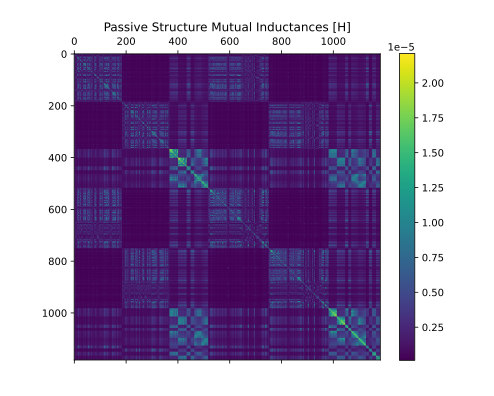

# Device Inductance

Tokamak core inductance matrices and flux tables, such as the one below:



## Methods

| Object | Methods                                       | Future Plans                            |
| ------ | -------                                       | ------                                  |
| Coils  | Axisymmetric filamentized & finite-difference flux and B-fields | 3D filamentized vector potential & B; finite element for B-fields near winding pack; 3D coil winding paths for non-axisymmetric coils |
| Passive Structures | Meshed axisymmetric filamentization; eigenmode model reduction | Finite element for 3D effects |
| Sensors | Ideal integrated response w/ numerical integration in space for flux loops and Bpol probes | Additional sensor kinds |
| Plasma | Grad-Shafranov flux solve via tabulated Green's functions OR finite difference w/ filamentized free boundary condition calc | Rigid-body dynamics linearization |


## Requirements

* Python 3.10-3.12 (use `pyenv` to manage multiple versions)
* pip
* gmsh
    * Nominally installs from pip automatically. If the python bindings don't find it, install it manually
    * `apt` (linux), `brew` (mac) and `chocolatey` (windows) all have gmsh available, and [the gmsh site](http://gmsh.info/) has binaries
* libglu1 (for linux and likely mac)
    * Required by gmsh and not always captured during gmsh install
* Environment capable of installing numpy, scipy, etc.
    * This is only difficult on windows native
    * For use on windows machines, WSL2 is recommended; Anaconda is not recommended

For local development, [poetry](https://python-poetry.org/docs/#installation) is also required.

## Installation

```bash
pip install device_inductance
```

or, to do a development install with the git repo checked out,

```bash
poetry install
```

## Usage

The flow of information is

[Input: ODS object] -> `device_inductance.DeviceInductance` -> Analysis -> [Output: Grids, Matrices, & Tables]

where the ODS object must be in the format provided by `device_description`.

To quickly compute the most commonly used items,

```python
import device_inductance

ods = device_inductance.load_default_ods()
typical_outputs = device_inductance.typical(ods, show_prog=False)

# With a computational grid spec provided, this would look like
# typical_outputs = device_inductance.typical(ods, extent, dxgrid)

# Extract values that are already calculated
mcc = typical_outputs.mcc  # [H] coil mutual inductance matrix

# If needed, this also provides access to the full
# DeviceInductance for more detailed outputs
device = typical_outputs.device
```

In relatively minimal form, a handle to not-yet-calculated values can be obtained like

```python
from device_inductance import DeviceInductance, load_default_ods

# Minimum input is just an ODS,
# but computational grid specs are required
# in order to generate non-empty flux tables
ods = load_default_ods()
device = DeviceInductance(ods, show_prog=False)

# Properties like this one are generated, along with their
# dependencies, the first time they are accessed.
mcc = device.coil_mutual_inductances
... # and so on
```

To get flux tables, we need to know the computational grid for which those tables will be generated.

```python
from device_inductance import DeviceInductance, load_default_ods

# Set up a regular computational grid
# The extent provided here is always _bounded_ by the resulting mesh,
# but in order to use the exact specified grid resolution, the actual extent
# may be expanded.
#
# In order for plasma flux tables along the boundary to compute properly,
# the minimum R value in the grid should be larger than the grid resolution.
# However, since plasma current should not exist on the boundary, those values
# should have no effect on most calculations.
dr, dz = (0.05, 0.05)  # [m] r,z grid resolution
min_extent = (dr * 2.0, 4.5, -3.0, 3.0) # [m] rmin, rmax, zmin, zmax

# This time, provide a grid spec
ods = load_default_ods()
device = DeviceInductance(ods, min_extent=min_extent, dxgrid=(dr, dz), show_prog=False)

# Get the resulting mesh
rmesh, zmesh = device.meshes
extent = device.extent # [m] Actual extent resolved when meshes are generated

# Now that we have a computational grid, we can
# calculate flux tables, which are also generated
# on first access.
psi_c = device.coil_flux_tables  # [Wb/A]
... # and so on
```

See examples for a more detailed workflow.

## Development

In the git repo, with the project installed locally via poetry,

```bash
MPLBACKEND="AGG" poetry run pytest .
```

will run the tests and examples with the headless AGG backend for matplotlib in order to suppress plots.

## Contributing

Contributions consistent with the goals and anti-goals of the package are welcome.

Please make an issue ticket to discuss changes before investing significant time into a branch.

Goals

* Library-level functions and formulas
* Comprehensive documentation including literature references, assumptions, and units-of-measure
* Quantitative unit-testing of formulas
* Performance (both speed and memory-efficiency)
    * Eliminate the need for databases to store the results of the computation
* Cross-platform compatibility
* Minimization of long-term maintenance overhead (both for the library, and for users of the library)
    * Semantic versioning
    * Automated linting and formatting tools
    * Centralized CI and toolchain configuration in as few files as possible

Anti-Goals

* Fanciness that increases environment complexity, obfuscates reasoning, or introduces platform restrictions
* Brittle CI or toolchain processes that drive increased maintenance overhead
* Application-level functionality (graphical interfaces, simulation frameworks, etc)

## License

Licensed under either of

* Apache License, Version 2.0, ([LICENSE-APACHE](../LICENSE-APACHE) or http://www.apache.org/licenses/LICENSE-2.0)
* MIT license ([LICENSE-MIT](../LICENSE-MIT) or http://opensource.org/licenses/MIT)

at your option.
